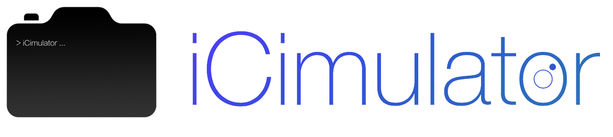
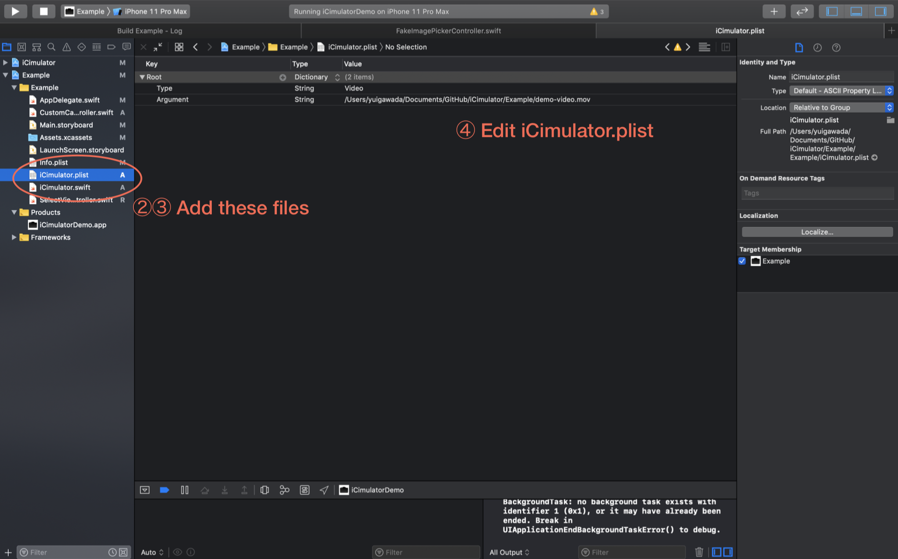
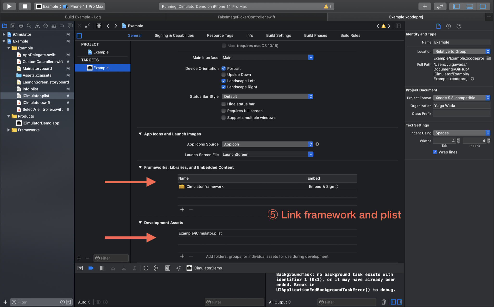
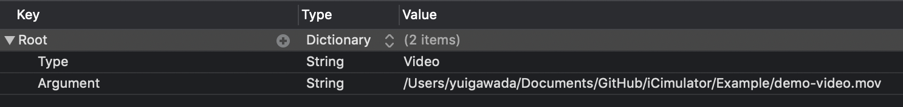

[![License][license-image]][license-url]
[![Swift Version][swift-image]][swift-url]
[](https://img.shields.io/cocoapods/v/LFAlertController.svg)
[](https://github.com/Carthage/Carthage)

<br>

## iOS Camera Simulator 📷


iCimulator allows us to use camera functions on iOS Simulator!

2019-Oct-23: **A new mode 'Mac Camera Mode' is added!**

→Click [here](#usage---mac-camera--) for details!
<!-- (日本語は[こちら](https://qiita.com/yuwd/items/)) -->

<br>

Support for **AVFoundation** & **UIImagePickerController** !

## Installation 🎈

#### CocoaPods
You can use [CocoaPods](http://cocoapods.org/) to install `iCimulator` by adding it to your `Podfile`:

```ruby
pod 'iCimulator'
```

#### Carthage
Create a `Cartfile` that lists the framework and run `carthage update`. Follow the [instructions](https://github.com/Carthage/Carthage#if-youre-building-for-ios) to add `$(SRCROOT)/Carthage/Build/iOS/iCimulator.framework` to an iOS project.

```
github "YuigaWada/iCimulator"
```

#### Manually
1. Download and drop ```iCimulator``` in your project.  
2. Congratulations!  

<br><br>

## Usage🍏 - Image or Video -  
**Just 5 steps!**

0. Prepare your mock data. (image/video)
1. Install ```iCimulator```.
2. Copy ```iCimulator.swift``` and ```iCimulator.plist``` to your project.
3. Set up ```iCimulator.plist``` , which is described what kind of mock data is used.
4. Link ```iCimulator.swift``` and ```iCimulator.plist``` to your project.

You can copy ```iCimulator.swift``` and ```iCimulator.plist``` from ```template``` folder.

<br>



<br><br>



<br><br>

**\*\*This 5-Steps MUST BE DONE on all projects which use camera functions.\*\***

<br><br>

### ```iCimulator.plist```

| Key | Value | Notes |
|:-----------|------------:|:------------:|
| Type | Image | You can set an image as a mock |
|  | Video | You can set a video as a mock |
|  | Mac-Camera | Click [here](#usage---mac-camera--) for details! |
|  |  |  |
| Argument | ... | Write here path of your mock data |

<br>



<br><br>

### ```iCimulator.swift```

```swift
//
//   ** iCimulator.swift **
//


// MIT License
//
// Copyright (c) 2019 YuigaWada
//
// Permission is hereby granted, free of charge, to any person obtaining a copy
// of this software and associated documentation files (the "Software"), to deal
// in the Software without restriction, including without limitation the rights
// to use, copy, modify, merge, publish, distribute, sublicense, and/or sell
// copies of the Software, and to permit persons to whom the Software is
// furnished to do so, subject to the following conditions:
//
// The above copyright notice and this permission notice shall be included in all
// copies or substantial portions of the Software.
//
// THE SOFTWARE IS PROVIDED "AS IS", WITHOUT WARRANTY OF ANY KIND, EXPRESS OR
// IMPLIED, INCLUDING BUT NOT LIMITED TO THE WARRANTIES OF MERCHANTABILITY,
// FITNESS FOR A PARTICULAR PURPOSE AND NONINFRINGEMENT. IN NO EVENT SHALL THE
// AUTHORS OR COPYRIGHT HOLDERS BE LIABLE FOR ANY CLAIM, DAMAGES OR OTHER
// LIABILITY, WHETHER IN AN ACTION OF CONTRACT, TORT OR OTHERWISE, ARISING FROM,
// OUT OF OR IN CONNECTION WITH THE SOFTWARE OR THE USE OR OTHER DEALINGS IN THE
// SOFTWARE.
//


#if targetEnvironment(simulator)
    import iCimulator

    //AVFoundation
    public typealias AVCaptureDevice = FakeCaptureDevice
    public typealias AVCaptureSession = FakeCaptureSession
    public typealias AVCaptureVideoPreviewLayer = FakePreviewLayer
    public typealias AVCapturePhotoOutput = FakeCapturePhotoOutput
    public typealias AVCapturePhotoCaptureDelegate = FakeCapturePhotoCaptureDelegate
    public typealias AVCapturePhoto = FakeCapturePhoto
    public typealias AVCaptureDeviceInput = FakeCaptureDeviceInput
    public typealias AVCaptureMovieFileOutput = FakeCaptureMovieFileOutput
    public typealias AVCaptureFileOutput = FakeCaptureFileOutput
    public typealias AVCaptureFileOutputRecordingDelegate = FakeCaptureFileOutputRecordingDelegate
    public typealias AVCaptureConnection = FakeCaptureConnection
    public typealias AVCapturePhotoSettings = FakeCapturePhotoSettings
    public typealias AVCaptureResolvedPhotoSettings = FakeCaptureResolvedPhotoSettings


    //For supporting iOS 10.
    public typealias AVCaptureStillImageOutput = FakeCaptureStillImageOutput
    public typealias CMSampleBuffer = FakeCMSampleBuffer

    //UIImagePickerController
    public typealias UIImagePickerController = FakeImagePickerController
    public typealias UIImagePickerControllerDelegate = FakeImagePickerControllerDelegate
#endif


```

<br><br>

## Usage🍎 - Mac Camera -  

**You can use your macbook camera to simulate camera functions!!**

First, you need to launch a camera-server on your MacBook.

Open ```streaming_server``` and launch ```streaming_server/server.py```!

<br>

After checking your ```iCimulator.plist```, you can see that your MacBook Camera is displayed on iOS Simulator 😊


### Dependencies

- Python 3.7.3
- Numpy
- opencv-python


### Options

You can use these options in using ```streaming_server/server.py```.
```

___________________________________________________________________________


██╗ ██████╗██╗███╗   ███╗██╗   ██╗██╗      █████╗ ████████╗ ██████╗ ██████╗
██║██╔════╝██║████╗ ████║██║   ██║██║     ██╔══██╗╚══██╔══╝██╔═══██╗██╔══██╗
██║██║     ██║██╔████╔██║██║   ██║██║     ███████║   ██║   ██║   ██║██████╔╝
██║██║     ██║██║╚██╔╝██║██║   ██║██║     ██╔══██║   ██║   ██║   ██║██╔══██╗
██║╚██████╗██║██║ ╚═╝ ██║╚██████╔╝███████╗██║  ██║   ██║   ╚██████╔╝██║  ██║
╚═╝ ╚═════╝╚═╝╚═╝     ╚═╝ ╚═════╝ ╚══════╝╚═╝  ╚═╝   ╚═╝    ╚═════╝ ╚═╝  ╚═╝

                                                            by Yuiga Wada.
___________________________________________________________________________

-v / -verbose / --verbose : turn on Verbose Mode.

-h / -help / --help : show help.

-c / -camera / --camera : enable you to show the captured frame on another window.

````

<br><br>

## Demo

### [```CameraKit```](https://github.com/CameraKit/camerakit-ios)


<br><br>

### [```Fusuma```](https://github.com/ytakzk/Fusuma)


<br><br>

## Todo📒
- [x] typealias対象のClass →互いに可換化
- [x] Carthageの準備
- [x] CocoaPodsの準備
- [ ] 日本語版READMEの作成


## Contribute

We would love you for the contribution to **iCimulator**, check the ``LICENSE`` file for more info.


## Others

Yuiga Wada -  [WebSite](https://yuiga.dev)
Twitter         - [@YuigaWada](https://twitter.com/YuigaWada)


Distributed under the MIT license. See ``LICENSE`` for more information.

[https://github.com/YuigaWada/iCimulator](https://github.com/YuigaWada/iCimulator)


[swift-image]:https://img.shields.io/badge/swift-5.0-orange.svg
[swift-url]: https://swift.org/
[license-image]: https://img.shields.io/badge/License-MIT-blue.svg
[license-url]: LICENSE
[codebeat-image]: https://codebeat.co/badges/c19b47ea-2f9d-45df-8458-b2d952fe9dad
[codebeat-url]: https://codebeat.co/projects/github-com-vsouza-awesomeios-com
